# Big Data Cloud – TP1 & TP2

[](https://www.python.org/)
[](https://flask.palletsprojects.com/)
[](https://www.mongodb.com/cloud/atlas)
[](https://leafletjs.com/)
[](https://neo4j.com/)
[](LICENSE)

---

## 📌 Description du projet

Ce dépôt contient les travaux pratiques **Big Data dans le cloud** réalisés dans le cadre des TP1 et TP2.  

- **Partie 1** : Dashboard interactif Vélib Paris en temps réel, utilisant MongoDB et Flask.  
- **Partie 2** : Projet Neo4J pour analyser les films Marvel et DC.  

---

## 🟢 Partie 1 – Dashboard Vélib Paris

Le but est de créer une interface web interactive permettant de visualiser les stations Vélib de Paris en temps réel avec des filtres et une carte dynamique.

### Fonctionnalités principales :

1. **Carte interactive avec Leaflet**  
   - Tous les stations sont affichées avec des markers clusterisés.  
   - Clic sur un marker filtre automatiquement les tables et selecteurs.

2. **Filtres**  
   - **Station** : filtrer par nom de station.  
   - **Arrondissement** : filtrer par arrondissement.  
   - **Nombre minimum de vélos électriques**.

3. **Tableaux dynamiques**  
   - Résumé par arrondissement (nombre de stations, eBikes, vélos classiques, total).  
   - Liste des stations filtrées avec eBikes, vélos classiques et total.

4. **Interactivité de la carte**  
   - Clic sur un marker filtre le tableau.  
   - Clic sur la carte vide réinitialise tous les filtres.  
   - Zoom/pan : seules les stations visibles sont affichées sur la carte.

5. **Mode sombre et chargement dynamique**  
   - Fond sombre pour le tableau et la page d’index.  
   - Spinner de chargement pendant la récupération des données depuis MongoDB.

6. **Données en temps réel**  
   - Les informations sont récupérées depuis MongoDB Atlas via l’API `/api/stations`.

---

## 🛠️ Technologies utilisées

- **Python 3.11**  
- **Flask** – framework web pour le serveur et les API  
- **MongoDB Atlas** – base de données cloud pour stocker les données Vélib  
- **Leaflet.js** – affichage de la carte et des markers  
- **Leaflet.markercluster** – clustering des stations sur la carte  
- **HTML / CSS / JS** – interface web responsive et dynamique  

---

## 🚀 Installation et utilisation

1. Cloner le dépôt :

```bash
git clone https://github.com/LudovicPicard/Big_Data_Cloud_TP1_TP2.git
cd Big_Data_Cloud_TP1_TP2
```

2. Créer un environnement virtuel et installer les dépendances :

```bash
python -m venv venv
source venv/bin/activate  # Linux/macOS
venv\Scripts\activate     # Windows
pip install -r requirements.txt
```

3. Configurer MongoDB Atlas et mettre à jour le uri dans app.py :

```bash
uri = "mongodb+srv://<username>:<password>@<cluster>.mongodb.net/?appName=TPBigData"
```

4. Lancer l’application Flask :

```bash
python app.py
```

5. Ouvrir le navigateur et accéder à : 

http://127.0.0.1:5000/

📂 Organisation du dépôt

Big_Data_Cloud_TP1_TP2/
│
├── app.py                 # Serveur Flask et API stations
├── templates/
│   ├── map.html           # Dashboard interactif avec Leaflet
│   └── index.html         # Page alternative ou tableau simple
├── Neo4J_Connect.py       # Partie Neo4J
├── velib_sync.py          # Scripts pour alimenter MongoDB (optionnel)
├─ db.csv                  # Dataset Marvel vs DC
├── README.md
└── requirements.txt       # Dépendances Python

🔗 Liens utiles

Documentation Flask

Documentation MongoDB

Leaflet.js

Leaflet MarkerCluster

📷 Capture d’écran :
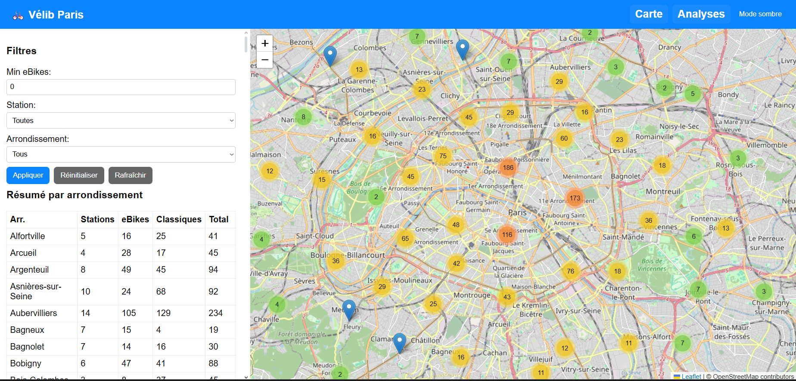
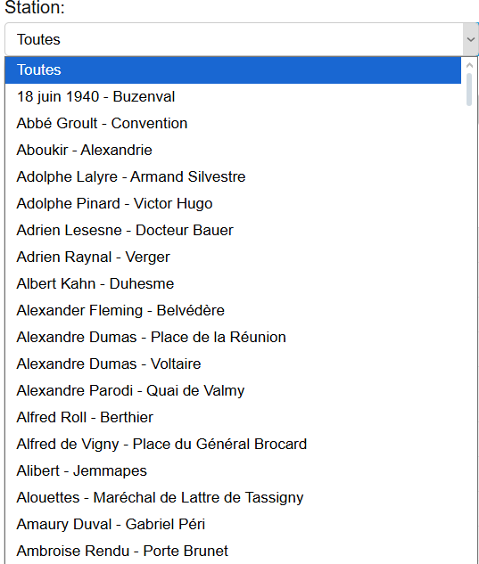
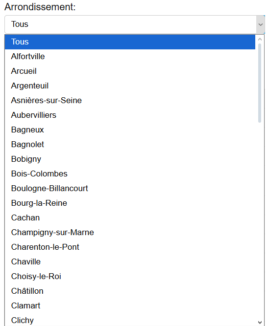
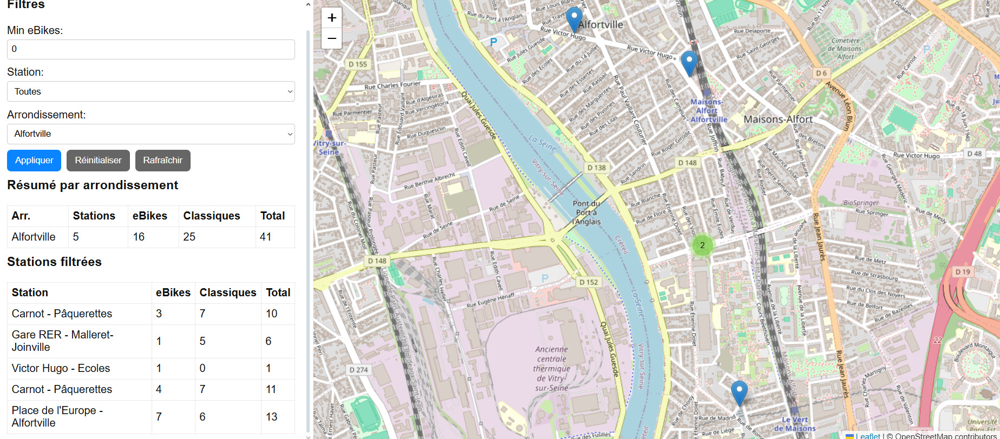
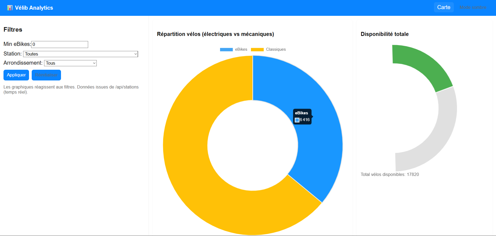
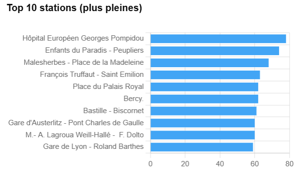


---

## 🟢 Partie 2 – Requêtes Neo4J

---

## 🔹 Installation

1. Cloner le dépôt
```bash
git clone https://github.com/LudovicPicard/Big_Data_Cloud_TP1_TP2.git
cd Big_Data_Cloud_TP1_TP2
```
2. Créer un environnement virtuel Python
```bash
python -m venv venv
source venv/bin/activate # Linux / Mac
venv\Scripts\activate    # Windows
```
3. Installer les dépendances
```bash
pip install -r requirements.txt
```
4. Lancer Neo4j
```bash
docker run --name neo4j -p 7474:7474 -p 7687:7687 -d -e NEO4J_AUTH=neo4j/password neo4j:5
```
5. Importer les données Marvel vs DC
```bash
python Neo4J_Connect.py
```
6. Exemples de Requêtes Cypher sur Neo4J

Films par studio
```bash
MATCH (m:Movie)
RETURN m.title AS Movie, m.company AS Studio
```
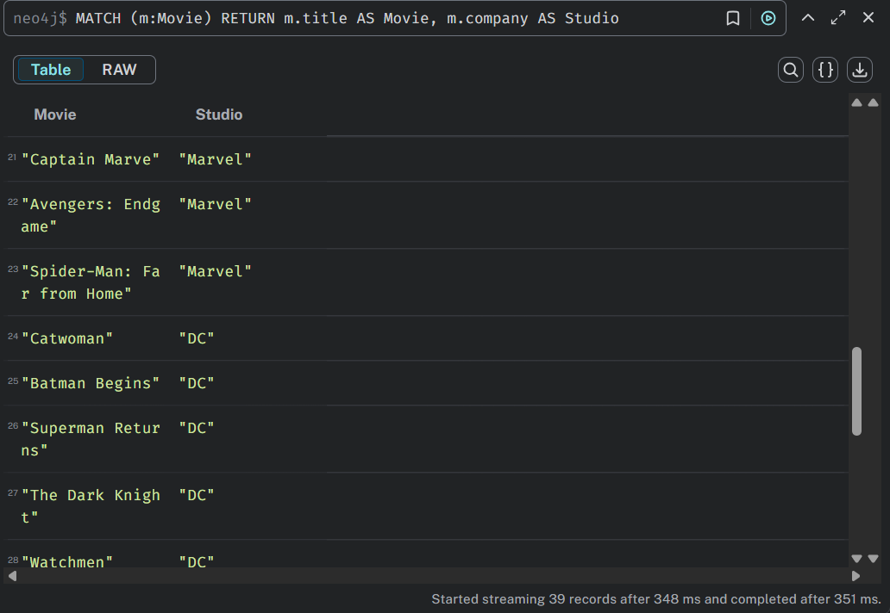

Films les plus rentables
```bash
MATCH (m:Movie)
WHERE m.budget IS NOT NULL AND m.gross_worldwide IS NOT NULL
RETURN m.title AS Movie, (m.gross_worldwide - m.budget) AS Profit
ORDER BY Profit DESC
LIMIT 20
```
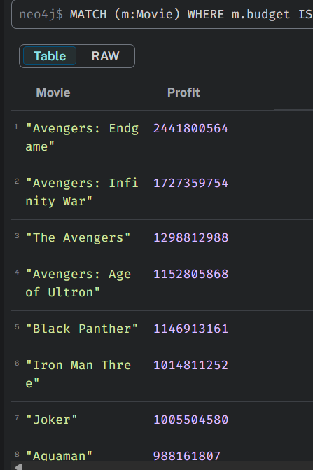

Distributions par decennie
```bash
MATCH (m:Movie)
WITH m, toInteger(substring(m.release,0,4)) AS year
WITH year - (year % 10) AS decade, collect(m.title) AS movies
RETURN decade, movies
```
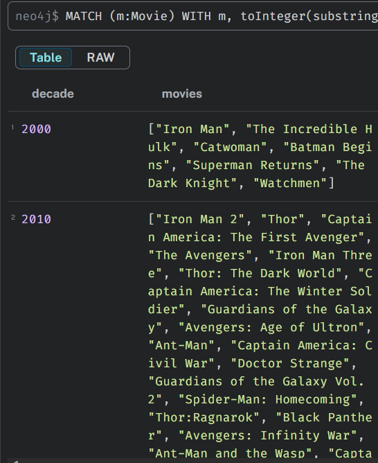

Films filtrés par note
```bash
MATCH (m:Movie)
WHERE m.rate >= 8
RETURN m.company AS Studio, m.title AS Movie, m.rate AS Rating
```
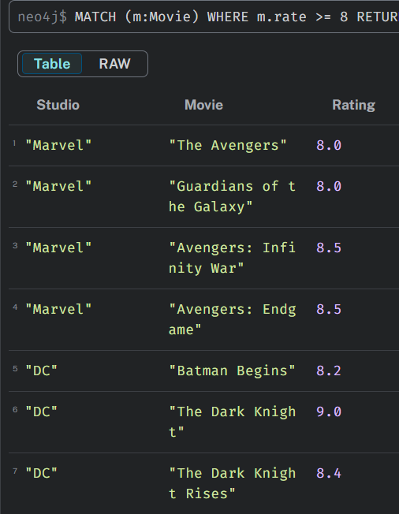

Profit vs Note
```bash
MATCH (m:Movie)
WHERE m.budget IS NOT NULL AND m.gross_worldwide IS NOT NULL AND m.rate IS NOT NULL
RETURN m.title AS Movie, m.rate AS Rating, (m.gross_worldwide - m.budget) AS Profit
```
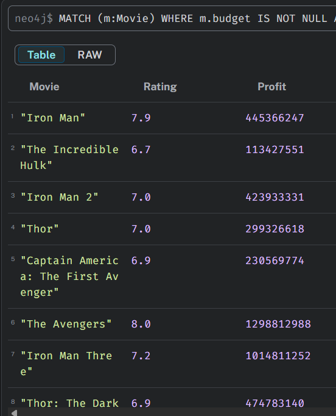

Filtre sur 10 films
```bash
MATCH (m:Movie)
RETURN m
LIMIT 10;
```
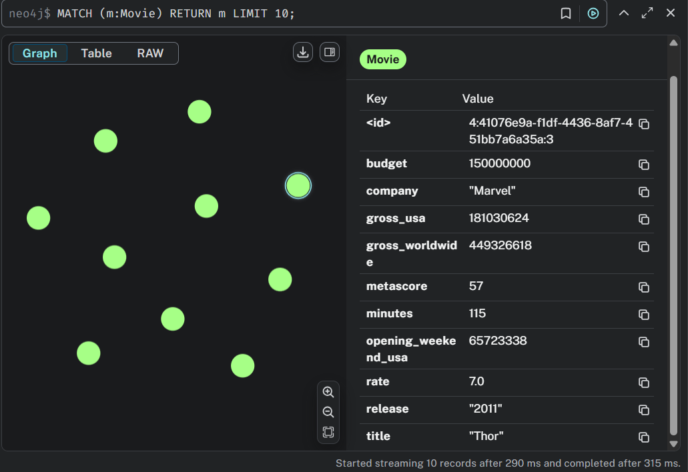

🔹 Auteur

Ludovic Picard